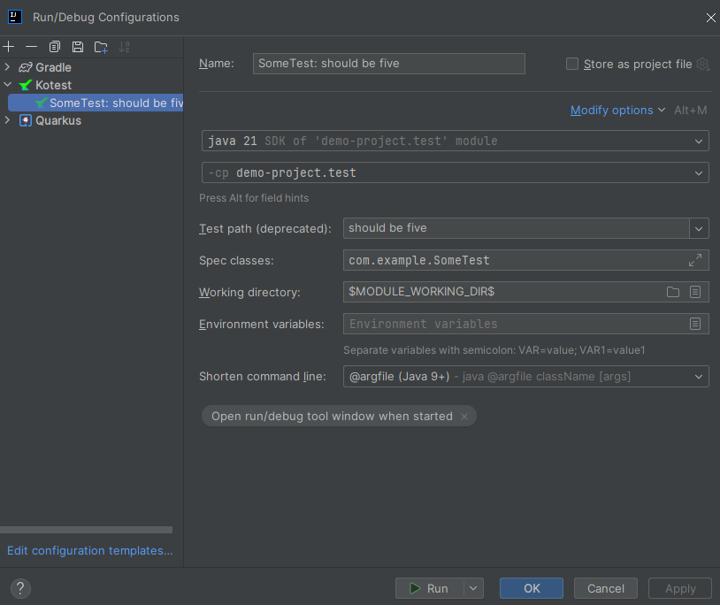
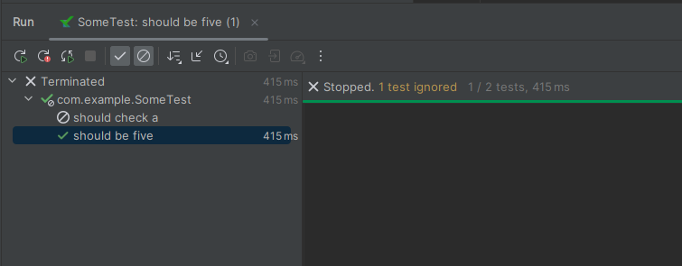

# Demo project to showcase issue

When running one specific test from the [FailingToRunIndividualTest.kt](src%2Ftest%2Fkotlin%2Fcom%2Fexample%2FFailingToRunIndividualTest.kt) file,
with the default configuration as seen below\

it runs successfully now:\
